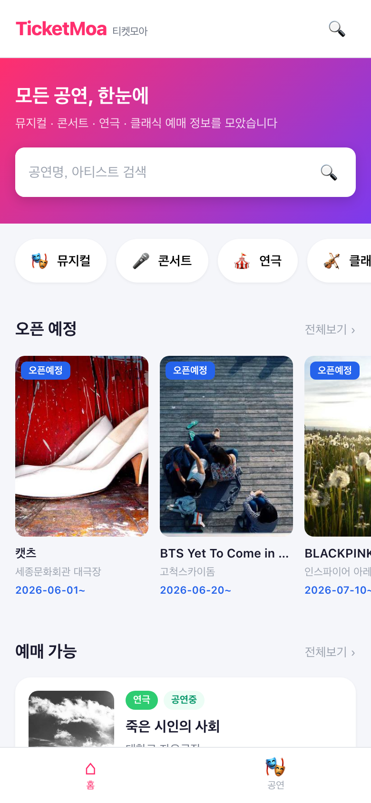
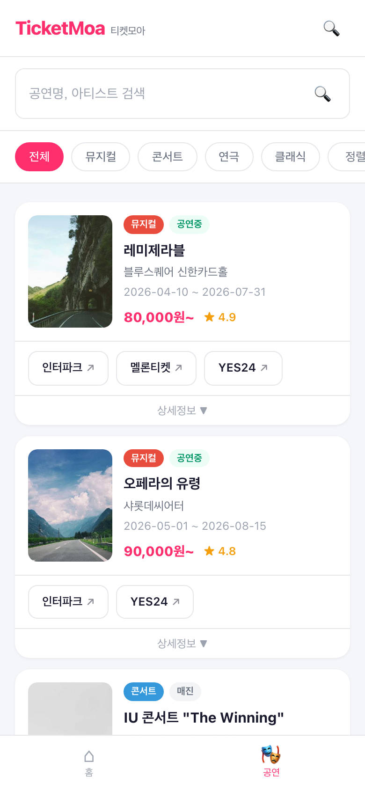
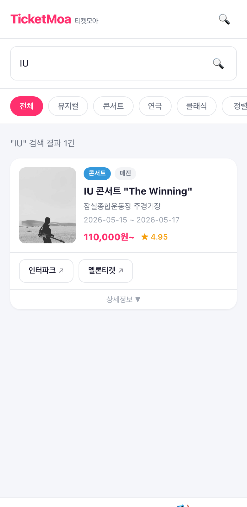

# TicketMoa (티켓모아)

> 뮤지컬, 콘서트, 연극, 클래식 등 모든 공연 정보를 한곳에서 확인하고, 예매 사이트로 바로 이동할 수 있는 **통합 공연 정보 서비스**입니다.

PDCA Team 프로젝트로 개발되었으며, [KOPIS(공연예술통합전산망)](http://www.kopis.or.kr) Open API를 활용하여 실시간 공연 데이터를 수집합니다.

---

## Screenshots

| 홈 화면 | 공연 목록 | 검색 결과 |
|:---:|:---:|:---:|
|  |  |  |

---

## 핵심 기능

- **공연 통합 검색** - 공연명, 아티스트, 공연장으로 검색
- **카테고리 필터** - 뮤지컬 / 콘서트 / 연극 / 클래식 분류
- **공연 상태 분류** - 공연중(예매 가능) / 공연예정(오픈 예정)
- **예매처 바로가기** - 인터파크, YES24, 멜론티켓 등 예매 사이트로 원클릭 이동
- **상세 정보 토글** - 출연진, 공연시간, 가격, 관람연령 등 카드 내에서 확인
- **자동 데이터 수집** - GitHub Actions로 매일 새벽 1시 KOPIS API 배치 동기화

---

## 시스템 아키텍처

```
┌─────────────────────────────────────────────────────────┐
│                    GitHub Actions                       │
│              (매일 01:00 KST 스케줄러)                    │
│                        │                                │
│              ┌─────────▼──────────┐                     │
│              │  sync-kopis.js     │                     │
│              │  (Batch Job)       │                     │
│              └─────────┬──────────┘                     │
│                        │                                │
│           ┌────────────▼────────────┐                   │
│           │   KOPIS Open API        │                   │
│           │   (공연목록/상세 조회)     │                   │
│           └────────────┬────────────┘                   │
│                        │                                │
│              ┌─────────▼──────────┐                     │
│              │   PostgreSQL       │                     │
│              │   (performances)   │                     │
│              └─────────┬──────────┘                     │
│                        │                                │
└────────────────────────┼────────────────────────────────┘
                         │
            ┌────────────▼────────────┐
            │  ticketmoa-server       │
            │  (Express API)          │
            │  DB > Sample 폴백       │
            └────────────┬────────────┘
                         │ /api/*
            ┌────────────▼────────────┐
            │  ticketmoa-client       │
            │  (React + Vite)         │
            │  Mobile-First UI        │
            └─────────────────────────┘
```

---

## 사용 기술 스택

### Frontend
| 기술 | 설명 |
|------|------|
| **React 19** | UI 라이브러리 |
| **Vite** | 빌드 도구 |
| **React Router v7** | SPA 라우팅 |
| **CSS (Mobile-First)** | 반응형 디자인, 앱 전환 고려 |

### Backend
| 기술 | 설명 |
|------|------|
| **Node.js** | 런타임 |
| **Express 5** | API 서버 |
| **PostgreSQL** | 공연 데이터 저장 |
| **node-postgres (pg)** | DB 클라이언트 |
| **axios + xml2js** | KOPIS API 호출 및 XML 파싱 |

### Infra / DevOps
| 기술 | 설명 |
|------|------|
| **GitHub Actions** | 배치 스케줄러 (cron) |
| **KOPIS Open API** | 공연예술통합전산망 데이터 소스 |

---

## 프로젝트 구조

```
project/
├── .github/
│   └── workflows/
│       └── sync-kopis.yml          # GitHub Actions (매일 01:00 KST)
├── ticketmoa-client/               # React 프론트엔드
│   ├── src/
│   │   ├── components/
│   │   │   ├── Header.jsx          # 상단 헤더
│   │   │   ├── BottomNav.jsx       # 하단 네비게이션
│   │   │   └── PerformanceCard.jsx # 공연 카드 (예매처 바로가기 포함)
│   │   ├── pages/
│   │   │   ├── HomePage.jsx        # 홈 (오픈예정/예매가능)
│   │   │   └── PerformanceListPage.jsx # 전체 공연 목록
│   │   ├── App.jsx
│   │   └── App.css                 # Mobile-First 스타일
│   └── vite.config.js              # API 프록시 설정
├── ticketmoa-server/               # Node.js 백엔드
│   ├── db/
│   │   ├── index.js                # PostgreSQL 연결 풀
│   │   ├── schema.sql              # 테이블 DDL
│   │   └── init.js                 # DB 초기화 스크립트
│   ├── scripts/
│   │   └── sync-kopis.js           # KOPIS 배치 동기화
│   ├── services/
│   │   └── kopisApi.js             # KOPIS API 클라이언트
│   ├── data/
│   │   └── performances.js         # 샘플 데이터 (폴백용)
│   ├── index.js                    # Express API 서버
│   └── .env                        # 환경변수 (git 제외)
├── docs/screenshots/               # README 스크린샷
├── package.json
├── .gitignore
└── README.md
```

---

## 실행 방법

### 1. 의존성 설치

```bash
cd ticketmoa-client && npm install
cd ../ticketmoa-server && npm install
```

### 2. 환경변수 설정

```bash
# ticketmoa-server/.env
PORT=5000
KOPIS_API_KEY=           # KOPIS API 키 (선택)
DATABASE_URL=            # PostgreSQL URL (선택)
```

> API 키와 DB 없이도 샘플 데이터로 동작합니다.

### 3. 개발 서버 실행

```bash
# 프로젝트 루트에서
npm run dev
```

- Frontend: http://localhost:3000
- Backend API: http://localhost:5000

### 4. DB 초기화 및 데이터 동기화 (선택)

```bash
cd ticketmoa-server
npm run db:init          # 테이블 생성
npm run sync             # KOPIS 데이터 동기화
```

---

## API 명세

| Method | Endpoint | 설명 |
|--------|----------|------|
| `GET` | `/api/health` | 서버 상태 확인 |
| `GET` | `/api/categories` | 카테고리 목록 |
| `GET` | `/api/performances` | 공연 목록 (필터/검색/정렬) |
| `GET` | `/api/performances/:id` | 공연 상세 |

**쿼리 파라미터 (`/api/performances`)**

| 파라미터 | 설명 | 예시 |
|----------|------|------|
| `category` | 카테고리 필터 | `musical`, `concert`, `theater`, `classic` |
| `status` | 공연 상태 | `on_sale`, `upcoming` |
| `search` | 키워드 검색 | `IU`, `레미제라블` |
| `sort` | 정렬 | `date`, `popularity` |

---

## GitHub Actions 설정

배치 동기화를 위해 GitHub Secrets에 등록:

| Secret | 설명 |
|--------|------|
| `KOPIS_API_KEY` | [KOPIS](http://www.kopis.or.kr) Open API 서비스 키 |
| `DATABASE_URL` | PostgreSQL 접속 URL |

---

## 라이선스

MIT License

---

<p align="center">
  <strong>PDCA Team</strong> | TicketMoa &copy; 2026
</p>
